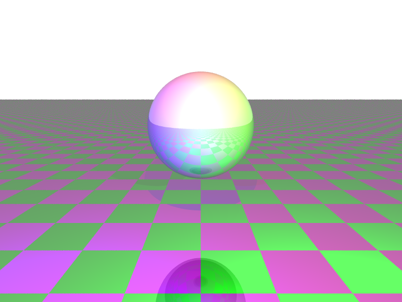
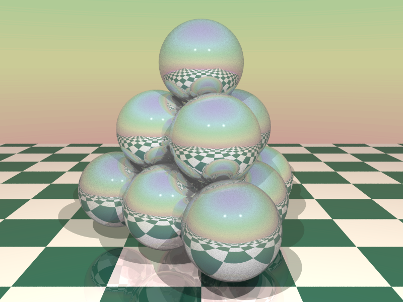
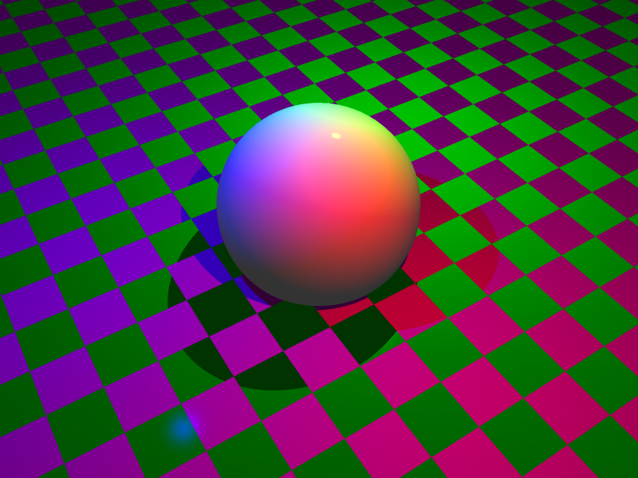

# Ray Tracing
Project I made in order to learn more about Ray Tracing. Based on some input files, a ppm image is generated representing a render of the image descripted on the file. Implemented in C# using OpenGL.

# Images

  
  
  
  

